CUDA Path Tracer
================

**University of Pennsylvania, CIS 565: GPU Programming and Architecture, Project 3**

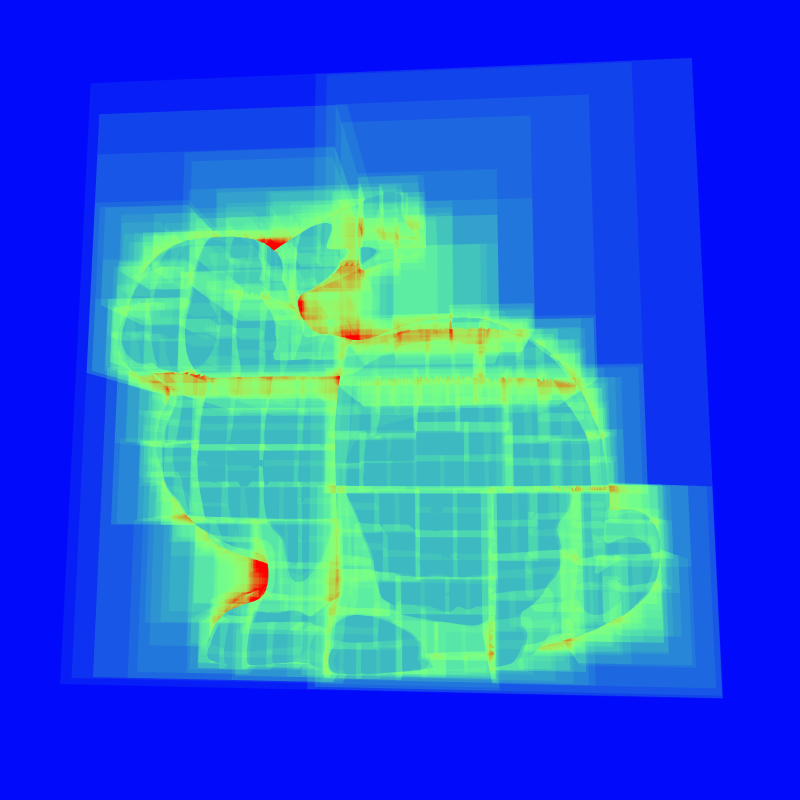

* Stephen Gavin Sears
  * [LinkedIn](https://www.linkedin.com/in/gavin-sears-536a1b285), [personal website](https://gavin-sears.github.io/sgavinsears/index.html)
* Tested on: Windows 11, i9-14900HX @ 2.20GHz 32GB, RTX 4090 Laptop 16GB, Compute Capability 8.9 (Personal Computer)

Features
================

### Basic Pathtracer

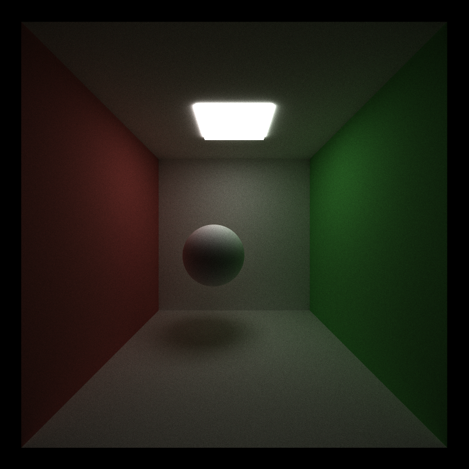

Simple diffuse materials, emissiveness, material sorting, and stream compaction.

### Material Sorting

*Performance analysis coming soon*

### Stream Compaction

*Performance analysis coming soon*

Extra Features
================

### Mesh Loading

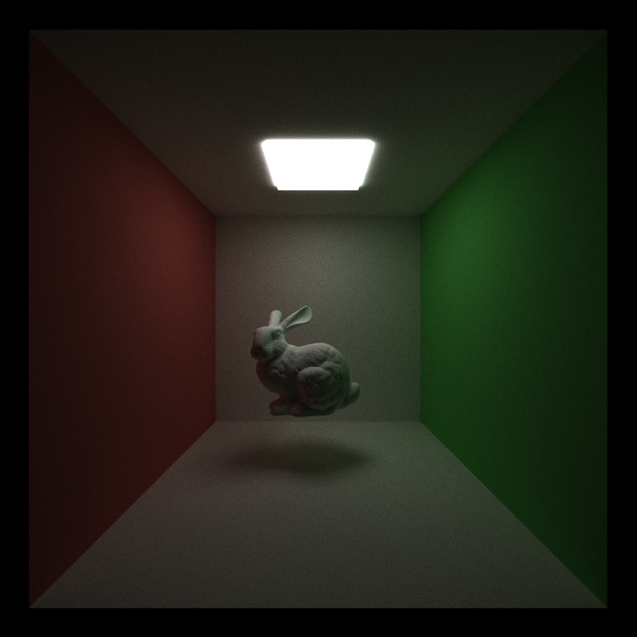

### BVH

<table border="0">
  <tr>
    <td>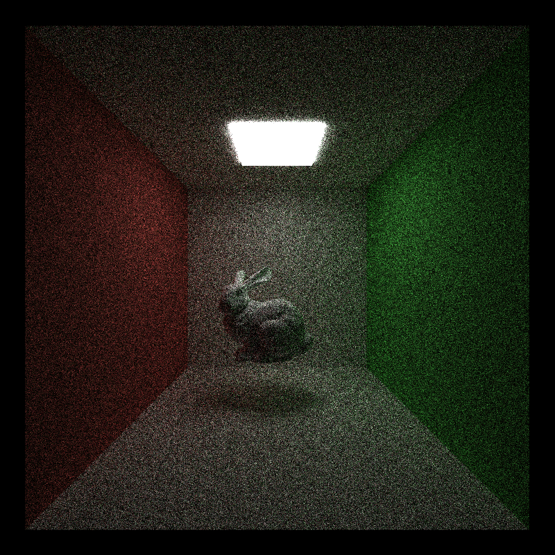</td>
    <td>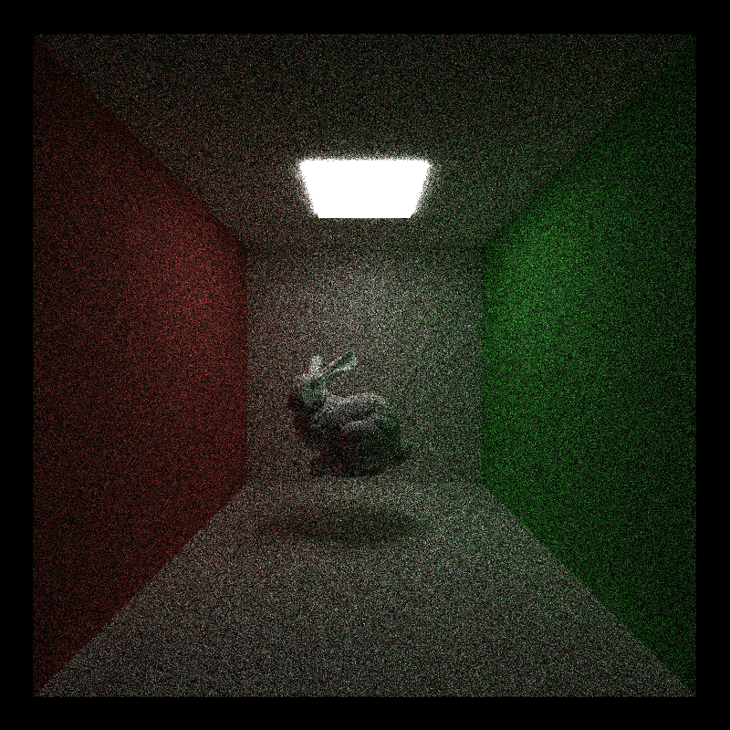</td>
  </tr>
  <tr align="center">
    <td><b>No BVH</b></td>
    <td><b>BVH</b></td>
  </tr>
</table>

I ran 50 iterations on a scene with a 69660 triangle stanford bunny, with the results displayed here so you can see that the visual output isn't different. I recorded how long it took to render each of them. 

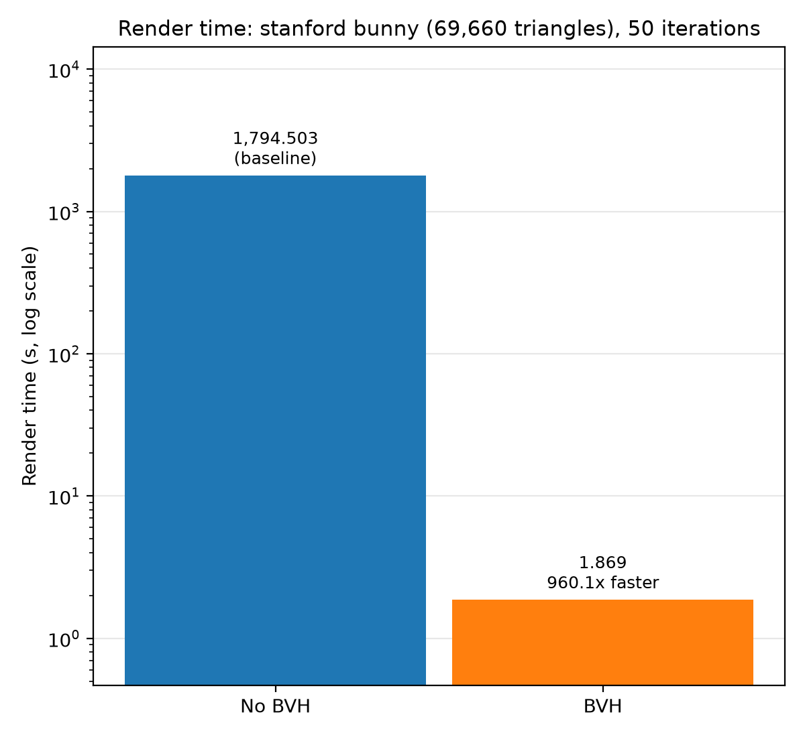

Without a BVH, it took 29 minutes and 54.503 seconds (1794.503s). With a bvh, that was shaved down to 1.869 seconds for 50 iterations. Doing the math, that is 99.896% less time, or around a 960x speedup, which should show just how essential using a bvh is when rendering meshes.

## So what is a BVH?

A Bounding volume hierarchy (BVH) improves performance in a pathtracer by making a ray's traversal through a scene more efficient. In a scene with n triangles, the naive way to check for intersections is to go through the n triangles and do intersection tests on each, which is an O(n) process. The BVH I implemented takes all of the triangle geometry, and calculates a bounding box (find corners of a slab that contains the entire mesh). After this, we find the largest axis, and find the median triangle along this axis, then use that to split our triangle data in two. Finally, we recurse the original BVH creation on each subset of triangles. The recursion depth goes until a set maximum limit, or if a node contains under a certain number of triangles (my performance charts and renders use 4 or below, and my BVH debug visuals use 64 or below, because using 4 for those images made it difficult to see). Traversing through this new data structure allows us to ignore roughly half (there can be overlaps in nodes) of the triangles at each step, which results in a O(log(n)) time complexity for checking triangle intersections.

<table border="0">
  <tr>
    <td>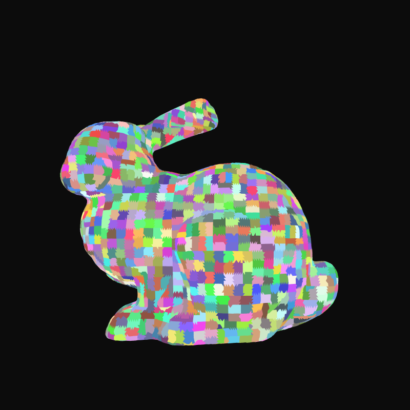</td>
    <td>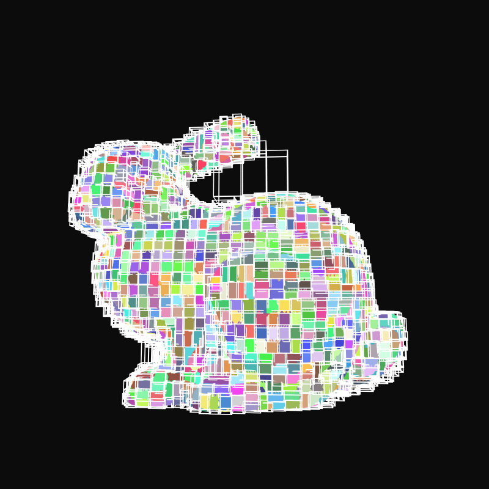</td>
  </tr>
  <tr align="center">
    <td><b>Triangles Colored Per Leaf</b></td>
    <td><b>Outlined Leaf Nodes</b></td>
  </tr>
</table>

<table border="0">
  <tr>
    <td></td>
    <td>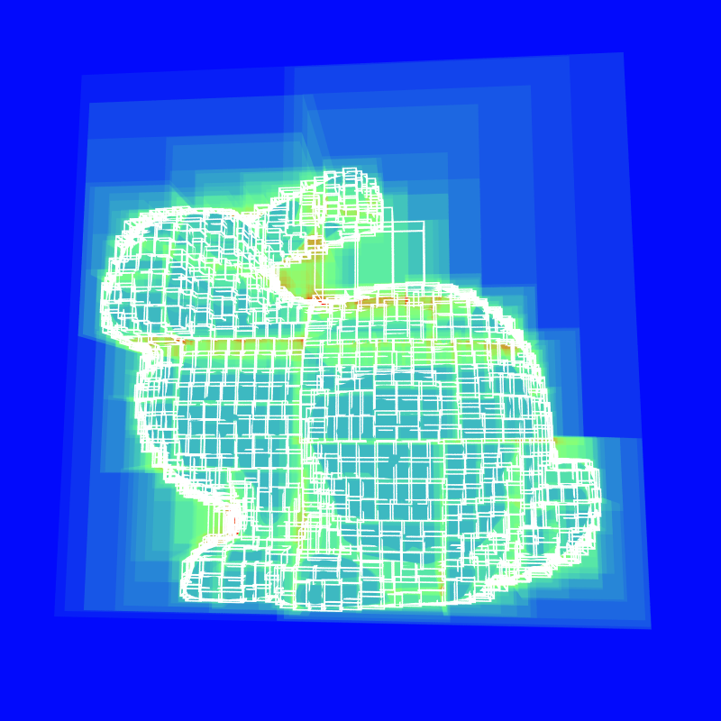</td>
  </tr>
  <tr align="center">
    <td><b>BVH Heatmap</b></td>
    <td><b>Outlined Leaf Nodes</b></td>
  </tr>
</table>

Above are two debugging views I implemented for the BVH. The first (top) view shows pixels with random colors that correspond to the leaf node which contains the triangle hit by the ray. The left and right side show this view without and with outlined leaf nodes in the scene respectively. 

The second (bottom) view shows a heatmap that describes how many traversals through the BVH happened at a given pixel in the screen. 
The blue and blue-green sections have minimal traversals, since there isn't any geometry near those places (such as those pale blue green boxes in the upper level, farther away from the mesh). 

Green means there were more BVH nodes to traverse through, but not too many. You'll notice green pixels somewhat closer to the mesh, and in the middle of it. Rays going straight towards the mesh traverse to one leaf node, but boxes beyond that are skipped once a hit is found. The green sections close to the mesh traverse more levels of the tree, but the lack of geometry nearby makes it still relatively inexpensive.

The red pixels very close to the mesh have the most traversals. That is because the ray is intersecting with multiple leaf nodes in the bvh before hitting anything (or not even hitting anything at all, which you can see on the edges of the mesh silhouette). Lastly, you'll also notice that you can see "grid lines" which separate the leaf nodes in the heatmap. This is because pixels at those points are entering more than one node before hitting the mesh, which makes those areas slightly more expensive.

I think the biggest optimization I could add to this BVH implementation would be the addition of SAH splitting to prevent more of the red spots that we see in the heatmap.

### UI customization

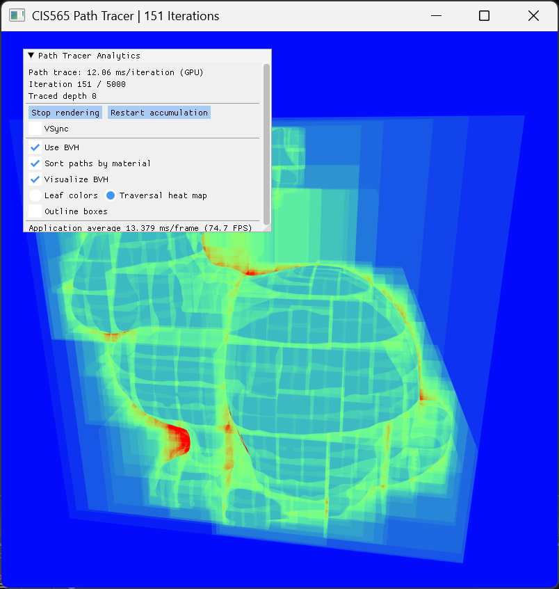

Some quality of life testing tools, like stopping and starting the render, toggling vsync (so I can make sure it's off), and toggling various performance enhancements and visuals like BVH, BVH debugging settings, and sorting paths by material.

### Fun Bloopers/Outtakes

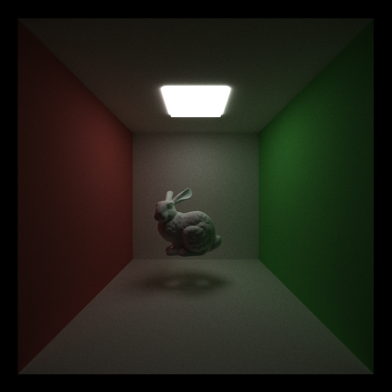

This scene appears to be normal, except that the shadow of the bunny has strange holes in it. For a while I was thinking this could be an issue with my BVH, but my non-bvh version also had this issue.
I threw the bunny into Blender to decimate it or subdivide it to see if the geometry density was the issue, and... there were holes in the bottom of the mesh which made it non manifold. It turns out that rays were shooting out of the camera, hitting the ground, bouncing up, going through the bunny, and then going through the backfaces (I use glm::intersectRayTriangle, which backface culls). From there the rays were finding the light, and so the floor got illuminated in those spots. I filled the holes in Blender, and that solved it.

### CHANGED CmakeLists.txt:

I added mesh.h to headers and mesh.cpp to sources for mesh loading.
I also added bvh.h and bvh.cpp to headers and sources for bvh.
Additionally, I added C compile options (for tiny gltf) and changed the preprocessor.